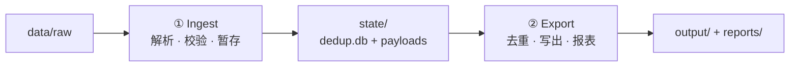
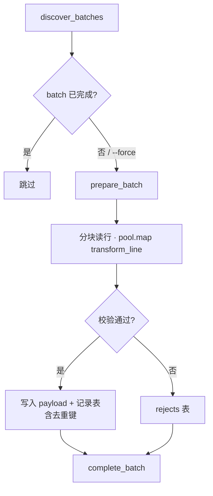
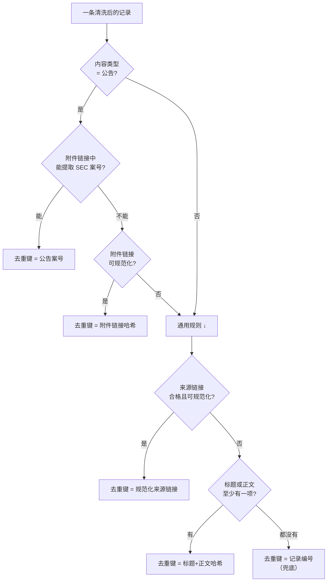
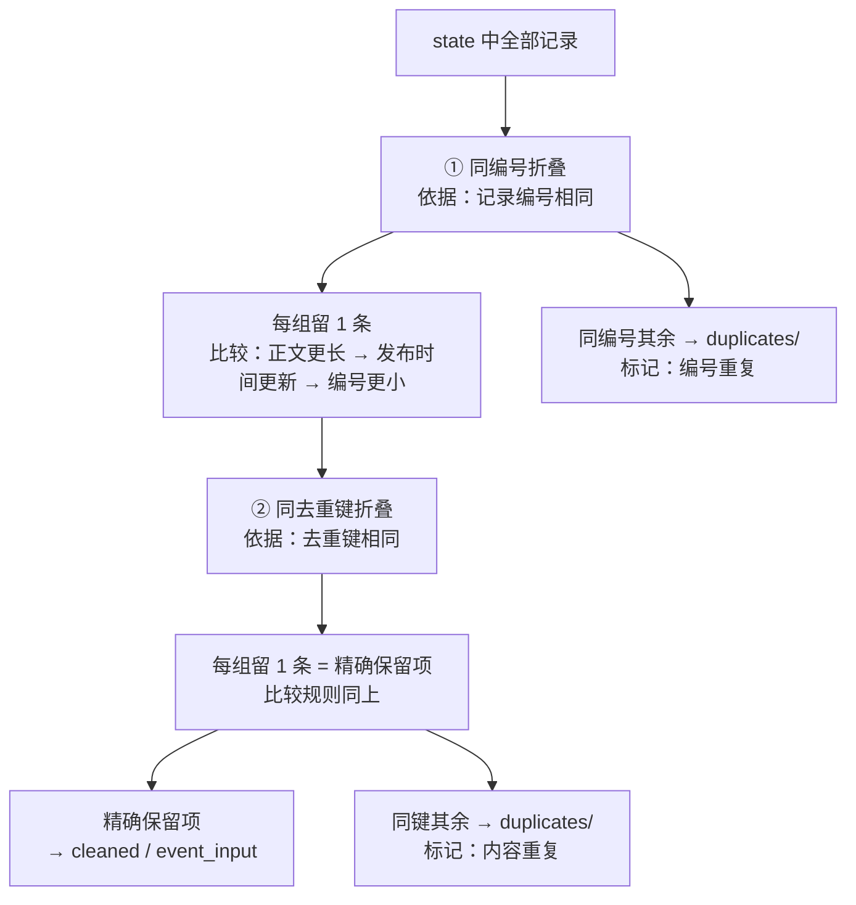
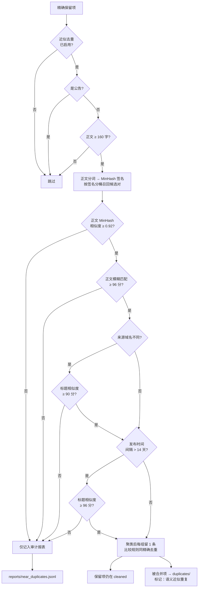

# aime_event

将原始 AIME 事件 NDJSON 清洗为审计记录与金融事件概念抽取输入。

## 快速开始

安装依赖：

```bash
python3 -m venv .venv
.venv/bin/python -m pip install -r requirements.txt
```

运行命令（**日常参数请在 [src/config.py](src/config.py) 用户配置区修改**）：

```bash
# 增量处理未完成的 batch
.venv/bin/python -m src.main

# 清空 state 后从 raw 全量重建
.venv/bin/python -m src.main fresh

# 不重新 ingest，仅从已有 state 重导出 output
.venv/bin/python -m src.main export
```

| 命令 | 行为 |
|------|------|
| `run`（默认） | 跳过已完成的 batch，处理新增部分 |
| `fresh` | 删除 state 后全量重跑 |
| `export` | 仅从 `state/dedup.db` 重导出 output 与 reports |

CLI 参数（`--workers`、`--no-near-dedup` 等）仅用于测试或一次性覆盖，见 `python -m src.main --help`。

当前挂载目录默认约定：

```text
/mnt/ainvest_content/v1/content_batch_*.ndjson  # 原始输入，仅扫描这些 batch 文件
/mnt/ainvest_content/v3/v1/cleaned_batch1.jsonl # 默认输出，20 万行一个分片
/mnt/ainvest_content/v3/v1/cleaned_batch2.jsonl
/mnt/ainvest_content/v3/v1/state/dedup.db     # 去重状态库，随结果保留
/mnt/ainvest_content/v3/v1/reports/           # 运行统计与近似去重审计报表
/tmp/aime_event/v1/state/                     # 运行中本地 state，减少 Ceph 随机 IO
...
```

默认只写 cleaned 输出；如需同时写出 `duplicates/`、`rejects/`、`event_input/` 辅助文件，运行时加
`--write-aux-outputs`。

长任务会默认按进度打印日志：每 `50000` 行或每 `15` 秒输出一次 ingest/export 状态。可用
`--log-every-rows`、`--log-every-seconds` 临时调整。

## 清洗流程

流水线分 **Ingest（写入 state）** 与 **Export（从 state 读出去重 + 写出）** 两阶段。`run` / `fresh` 先 ingest 再 export；`export` 跳过 ingest，直接从已有 `state/` 重导出。

### 总览



| 命令 | Ingest | Export |
|------|--------|--------|
| `run` | 增量，跳过已完成 batch | ✓ |
| `fresh` | 清空 state 后全量 | ✓ |
| `export` | 跳过 | 仅从 state 重导出 |

Ingest 校验失败与 Export 重复记录分别进入 `rejects/`、`duplicates/`；近似去重候选对写入 `reports/near_duplicates.jsonl`（见阶段对照表）。

### Ingest 细节

每条 NDJSON 经 `transform_line` 解析；通过校验后计算**去重键**写入 state。**此时不做保留项判定**。



**transform 步骤**（`src/ingest/transform.py`）：orjson 解析 → HTML 转纯文本 → 字段映射（source / entities / notice / tags）→ 校验 id、content_type、时间、正文。

### 去重流程

去重分两阶段：**写入 state 时为每条记录算出去重键**；**导出 output 时按去重键选保留项，再对保留项做语义近似合并**。下图按判定顺序展开，节点内即「依据什么字段 / 规则」。

#### 时机

| 步骤 | 执行阶段 | 做什么 |
|------|----------|--------|
| 计算去重键 | Ingest | 逐条记录生成去重键，写入 state |
| 精确去重 | Export | 同编号折叠 → 同去重键选保留项 |
| 近似去重 | Export | 仅对精确保留项，按正文/标题相似度合并（可关） |

#### 第一步：计算去重键（Ingest）

每条通过校验的记录，按下列**优先级**生成唯一去重键（只算键，不决定谁保留）：



**各键依据的原始字段：**

| 去重键 | 读取字段 | 说明 |
|--------|----------|------|
| 公告案号 | 公告附件链接 | 从 SEC 链接提取 accession |
| 附件链接哈希 | 公告首个附件链接 | 规范化后 SHA-256 |
| 来源链接 | 文章来源 URL | 去追踪参数、统一大小写；排除 feed/API/站点地图等 |
| 标题+正文哈希 | 标题、正文 | 去空白、小写、合并空格后 SHA-256 |
| 记录编号 | 原始 `_id` | 以上均不可用时的兜底 |

#### 第二步：精确去重（Export）

Export 时在数据库内建「保留项表」，两轮筛选：



#### 第三步：近似去重（Export，可关闭）

**仅对第二步的精确保留项**做语义合并；配置见 `src/config.py` 近似去重区。



**近似去重读取的字段：**

| 用途 | 字段 |
|------|------|
| 是否参与 | 内容类型、正文字数 |
| 召回候选 | 正文（分词 shingle → MinHash） |
| 正文确认 | 正文（模糊匹配得分） |
| 标题确认 | 标题（模糊匹配得分） |
| 跨站过滤 | 来源链接的域名 |
| 时间过滤 | 发布时间 |

#### 保留项选取规则（精确与近似共用）

多条竞争同一保留位时，依次比较：

1. **正文更长**
2. **发布时间更新**
3. **记录编号字典序更小**
4. **所在 batch 行号更早**（仅精确去重兜底）

#### 重复记录去向

| 重复类型 | 判定依据 | 输出位置 |
|----------|----------|----------|
| 编号重复 | 记录编号相同 | `duplicates/` |
| 内容重复 | 去重键相同 | `duplicates/` |
| 语义近似 | 正文/标题高度相似且通过规则 | `duplicates/` |
| 低置信候选 | 相似但未达合并阈值 | 仅 `reports/near_duplicates.jsonl` |

### 阶段对照

| 阶段 | 触发命令 | 核心模块 | 输入 → 输出 |
|------|----------|----------|-------------|
| Ingest | `run` / `fresh` | `pipeline/runner` · `ingest/transform` · `storage/staging` | raw NDJSON → `state/dedup.db` + `payloads/`；reject 暂存 DB |
| 精确去重 | 三者均 export | `storage/winners` · `dedup/exact` | `records` → `dedup_winners` + `duplicate_records`（content / id） |
| 近似去重 | 三者均 export | `storage/winners` · `dedup/near` | `dedup_winners` → `near_duplicate_losers` + 审计候选对 |
| 写出 | 三者均 export | `pipeline/runner` · `output/views` · `pipeline/writers` | state → `cleaned/` · `event_input/` · `duplicates/` · `rejects/` |
| 报表 | 三者均 export | `reporting/writer` | state + output 计数 → `reports/` · `progress.json` |

## 目录结构

```
data/raw/              # 原始输入（content_batch_*.ndjson）
output/
  cleaned/             # canonical 审计记录（CleanedRecord）
  duplicates/          # 重复记录，含 dedup.canonical_id
  event_input/         # 事件抽取输入（EventRecord）
  rejects/             # 被拒绝的原始行及原因
state/
  dedup.db             # SQLite 暂存与去重状态（schema v4）
  payloads/            # 二进制 payload 分片
  progress.json        # 已完成 batch 列表
reports/               # 统计报表，见 reports/README.md
schema/                # 输出格式 JSON Schema，见 schema/README.md
src/                   # 源代码（按模块分包）
```

## 配置

编辑 [src/config.py](src/config.py) 顶部的**用户配置区**：

| 配置项 | 说明 |
|--------|------|
| `INPUT_DIR` | 原始 NDJSON 目录 |
| `WORKERS` | 并行进程数，建议 ≤ CPU 核数 |
| `CHUNK_SIZE` | 每批 transform 行数，影响内存 |
| `PART_SIZE` | 每个输出 NDJSON 分片最大行数 |
| `NEAR_DEDUP_ENABLED` | 是否启用近似去重自动合并 |
| `NEAR_THRESHOLD` | MinHash Jaccard 阈值（0~1），越高越保守 |
| `NEAR_FUZZY_THRESHOLD` | RapidFuzz 正文相似度阈值（0~100） |
| `NEAR_MAX_REPORT_PAIRS` | `near_duplicates.jsonl` 最多写入对数 |

完整参数列表与中文注释见 `src/config.py`。

若存在旧版 `state/dedup.db`，需执行 `python -m src.main fresh` 重建。

## 输出格式

- **CleanedRecord**（`output/cleaned/`、`output/duplicates/`）：完整审计格式，含 `dedup` 溯源。详见 [schema/README.md](schema/README.md)。
- **EventRecord**（`output/event_input/`）：精简抽取格式，无 `dedup`/`meta`。
- 公开输出不使用 `null`，空可选字段省略。

## 报表

流水线结束后在 `reports/` 生成：

- `summary.json` — 全库汇总
- `batch_stats.jsonl` — 按 batch 统计
- `near_duplicates.jsonl` — 近似去重审计日志
- `index.json` — 文件索引与 schema 路径

字段说明见 [reports/README.md](reports/README.md)。

## 去重规则

完整判定流程见上文 **[去重流程](#去重流程)** 三张图。实现位于 `src/dedup/exact.py`（精确键）与 `src/dedup/near.py`（近似合并）。

### 语义去重验证

可用以下方式确认近似去重已生效（以当前数据为例）：

```bash
# 1. 汇总数字一致：auto_merged 条数 = duplicates 中 near_minhash 条数
jq '.near_duplicates_auto_merged' reports/summary.json
jq -s '[.[] | select(.dedup.method == "near_minhash")] | length' output/duplicates/*.ndjson

# 2. loser 不应出现在 cleaned 中（结果为 0）
jq -s '[inputs | select(.dedup.method == "near_minhash") | .id] | .[]' output/duplicates/*.ndjson \
  | while read id; do jq -e --arg id "$id" 'select(.id == $id)' output/cleaned/*.ndjson && echo "LEAK: $id"; done

# 3. 查看自动合并的语义相似对（正文 fuzzy=100、标题略有差异）
head -3 reports/near_duplicates.jsonl | jq '{status, reason, left: .left.title, right: .right.title, scores}'
```

当前数据集验证结果：`near_duplicates_auto_merged=25`，25 条 `near_minhash` 重复均已移入 `duplicates/`，canonical 均在 `cleaned/`，无 loser 泄漏。典型合并案例如同一机器人快讯「ASR Rises 5.86%」与「ASR Rises 5.86% on Market Activity」——正文完全相同，仅标题措辞不同。

## 代码结构

```
src/
  config.py          # 用户可编辑配置
  cli/main.py        # 命令行入口
  ingest/            # 原始 JSON 解析与 HTML 转文本
  dedup/             # 精确与近似去重算法
  storage/           # SQLite 暂存与 payload
  pipeline/          # 批次编排与导出
  output/            # 公开记录格式投影
  reporting/         # 报表生成
```

## 验证

```bash
.venv/bin/python -m pytest -q
pyright src
jq -r '.dedup.key' output/cleaned/*.ndjson | sort | uniq -d
jq -n '[inputs | .. | select(. == null)] | length' output/cleaned/*.ndjson
```

合成数据压测：

```bash
.venv/bin/python scripts/benchmark_synthetic.py --rows 100000 --workers 4 --near-every 5
```
